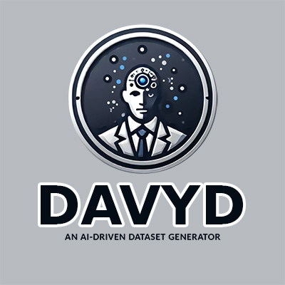

# DAVYD – AI-Powered Dataset Generator 🚀🔥  

> **This is the _Zeus Eternal_ desktop fork.**  
> Upstream project by **[agustealo](https://github.com/agustealo/DAVYD)** · Desktop revamp by **[Zeus Eternal](https://github.com/Zeus-Eternal)**



---

## ❓ Why this fork?

| &nbsp; | Upstream `agustealo/DAVYD` | **Zeus-Eternal Fork** |
|-------|----------------------------|-----------------------|
| **Interface** | Streamlit web app | **PySide6 desktop GUI** (`src/ui_desktop.py`) |
| **Generation core** | Direct LLM ➜ optional Autogen fallback | **Autogen is the default path** – `AssistantAgent + ProxyAgent` |
| **Concurrency** | Synchronous | Qt `QThread` for non-blocking generation |
| **Run command** | `streamlit run src/ui.py` | `python src/ui_desktop.py` |
| **Legacy support** | – | Streamlit UI kept as `src/ui_streamlit.py` |

If you like DAVYD but prefer a native window ― or need long-running generation without blocking the UI ― this fork is for you.

---

## 🗒️ Change Log

| Date&nbsp; | Version | Notes |
|------------|---------|-------|
| **2025-05-03** | `v2.0` | Initial desktop release: PySide6 rewrite, themed tabs/menu, full Autogen pipeline, threaded generation, dark/light toggle. |
| 2025-05-03 | `v2.0.1` | Fixed missing `use_autogen` arg; added error pop-ups & progress signals. |
| 2025-05-03 | `v2.0.2` | Provider health-check, graceful Ollama absence, `.gitignore` clean-up. |

Detailed commit history lives in the **[GitHub “Commits” tab](../../commits/main)**.

---

## Table of Contents
- [What is DAVYD?](#what-is-davyd)
- [Key Features](#key-features)
- [Installation](#installation)
- [Getting Started](#getting-started)
- [Acronym Breakdown](#acronym-breakdown-davyd)
- [Features Overview](#features-overview)
- [Usage Examples](#usage-examples)
- [Contribution](#contribution)
- [License](#license)
- [Support](#support)

---

## 🤖 What is DAVYD?

**DAVYD** (Dynamic AI Virtual Yielding Dataset) is an intelligent dataset generator powered by LLMs.  
It enables developers and data-scientists to **define a schema → generate a realistic dataset → validate / visualise / export** with minimal friction.

---

## ✨ Key Features

* **Customisable schema** – define any number of fields & example rows.  
* **Multi-provider generation** – Ollama, DeepSeek, Gemini, ChatGPT, Anthropic, Claude, Mistral, Groq, HuggingFace.  
* **Autogen agent stack** (desktop fork) – resilient, self-healing generation.  
* **Validation + quality dashboards** – catch issues early.  
* **Dataset life-cycle** – archive, restore, merge, delete, download.  
* **Multiple export formats** – CSV / JSON / Excel.  
* **Two UIs** – modern PySide6 desktop **or** Streamlit web for quick demos.

---

## 🛠️ Installation

```bash
# 1. clone the fork
git clone https://github.com/Zeus-Eternal/DAVYD.git
cd DAVYD

# 2. create venv + install deps
python -m venv env
source env/bin/activate      # <─ Windows: env\Scripts\activate
pip install -r requirements.txt
````

### Optional extras

- **Desktop only** – PySide6 is already in `requirements.txt`.
    
- **Streamlit UI** – Streamlit is also included; nothing extra to do.
    

---

## 🚀 Getting Started

### Run the desktop GUI

```bash
python src/ui_desktop.py
```

### (or) launch the classic Streamlit UI

```bash
streamlit run src/ui_streamlit.py
```

Then open [http://localhost:8501](http://localhost:8501/) in your browser.

---

### Define your dataset (schema → examples → generate)

1. **Dataset Structure tab**
    
    - Add field names & a few example rows.
        
2. **Generation tab**
    
    - Pick provider, paste API key (or Ollama URL), choose a model.
        
    - Set “Entries” + “Quality” → **✨ Generate Dataset**.
        
3. **Visualisation tab**
    
    - Inspect the live table, search, plot histograms, pie charts, etc.
        
4. **Management tab**
    
    - Archive, restore, merge, download, or delete datasets.
        

---

## 🔤 Acronym Breakdown: DAVYD

|Letter|Meaning|
|---|---|
|**D**|Dynamic|
|**A**|AI|
|**V**|Virtual|
|**Y**|Yielding|
|**D**|Dataset|

---

## 📚 Features Overview

### 1 – Desktop UI (new)

- Qt menu-bar, keyboard shortcuts, zoom, dark/light theme.
    
- Non-blocking dataset generation via `DatasetGenerationThread`.
    

### 2 – AI Model Integration

- Providers pluggable through `model_providers.py`.
    
- Health-check verifies connectivity before generation starts.
    

### 3 – Data Validation

- Automatic field count, empty-value & type checks.
    
- Tenacity-backed retries for flaky network/API calls.
    

### 4 – Dataset Management

- **Archive** ➜ moves to `data_bin/archive`
    
- **Merged** ➜ collate datasets into a single file
    
- **Restore / Delete / Download** via UI buttons
    

---

## 💡 Usage Examples

### Sentiment Analysis Dataset (150 rows)

```text
Fields: text | intent | sentiment | sentiment_polarity | tone | category | keywords
Example row:
"I love this product!" | "affirmation" | "positive" | 0.9 | "enthusiastic" | "review" | "love product"
```

_Generate → export as `sentiment_analysis.csv`._

### Intent Classification Dataset

1. Load template `intent_classification.json`.
    
2. Generate 200 rows.
    
3. Export as JSON for direct ML ingestion.
    

---

## 🤝 Contribution

Pull requests are very welcome!

```bash
# fork → feature branch → PR
git checkout -b my-feature
# hack hack
git commit -am "Add awesome feature"
git push origin my-feature
```

Please open an issue first if you plan a large change.

---

## 📝 License

Released under the [MIT License](https://chatgpt.com/g/g-p-6812ca0ab8b881918aaf47ab1a7da457-davyd/c/LICENSE).

---

## 📬 Support

- Fork maintainer: **Zeus Eternal** – [https://github.com/Zeus-Eternal](https://github.com/Zeus-Eternal)
    
- Upstream author: **agustealo** – [agustealo@gmail.com](mailto:agustealo@gmail.com)
    

Happy dataset generation! ✨
